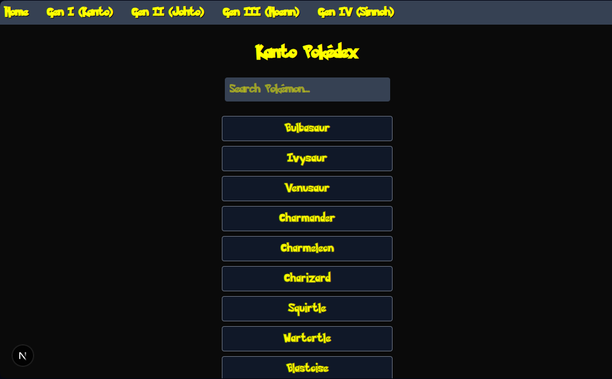
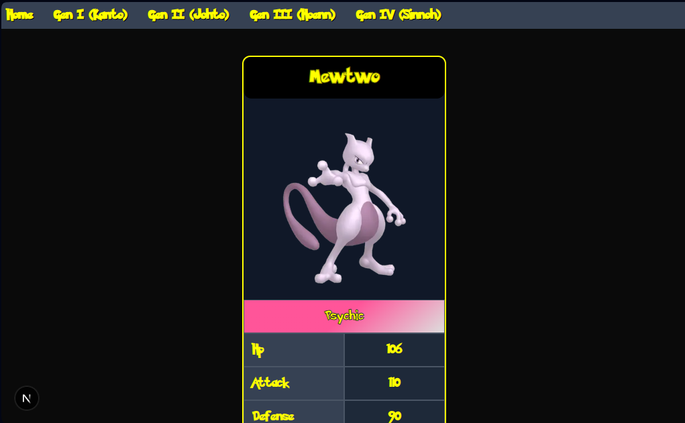
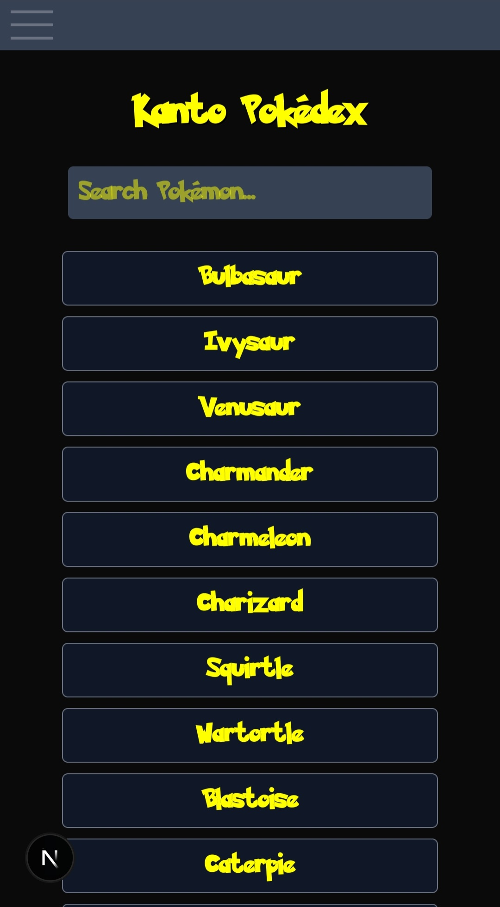
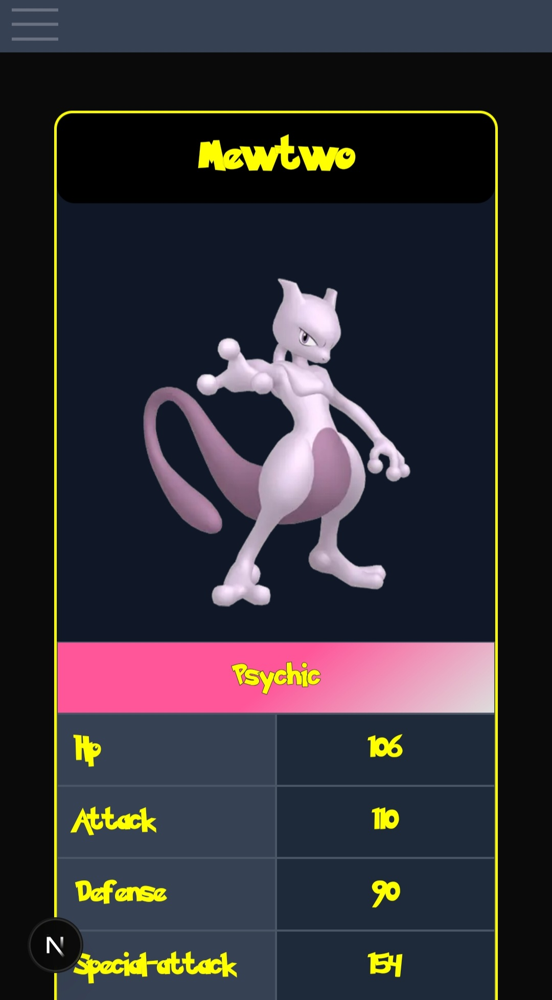

# Pokédex Next

## Table of Contents
- [About](#about)
- [Usage](#usage)


## About

A Pokédex style web app that presents a list containing all of the Generation I (Kanto) Pokémons. Users can select each Pokémon to obtain more info about their base stats and types.

### Screenshots

#### Desktop web UI

<div style="display: flex; gap: 1rem;">
  
  
</div>

#### Mobile web UI

<div style="display: flex; gap: 1rem;">
  
  
</div>

## Usage

Install dependencies
```bash
cd ./pokedex-next && npm install
```

### Production mode

Build the app
```bash
npm run build
```

Start the app
```bash
npm run start
```

### Development mode

Start the Next dev server (supports hot-reloading)
```bash
npm run dev
```
